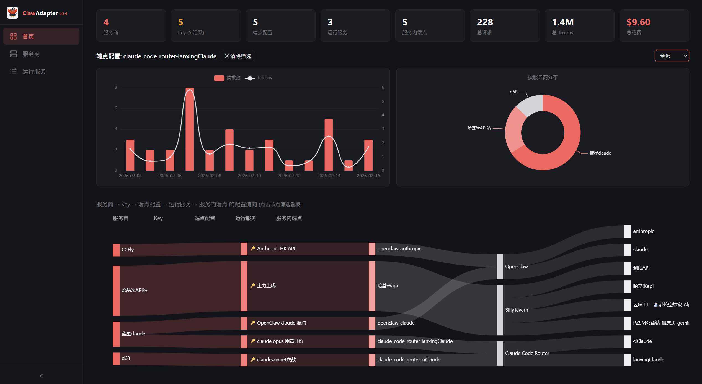

<p align="center">
  <strong>English</strong> | <a href="README_CN.md">中文</a>
</p>

<p align="center">
  
</p>

<h1 align="center">ClawAdapter</h1>

<p align="center">
  <strong>Lightweight API Key & Service Configuration Management Middleware</strong>
</p>

<p align="center">
  
  
  
  
</p>

---

## 🚧 Work in Progress

- API pricing feature under development
- Sankey diagram display optimizations pending

## Overview

Managing API keys across multiple AI services is painful — each service has its own config, and changing one key means copy-pasting everywhere.

ClawAdapter centralizes vendor, key, and downstream service configuration in one place. Once bound, a single change syncs to all linked services automatically.

<p align="center">
  
</p>

## Architecture

```
Vendor → Key → Provider → Adapter → Service
```

Strict five-layer flow — no skipping layers. Every Provider must be linked to a Key, and every Key must belong to a Vendor.

## Features

| Feature | Description |
|---------|-------------|
| 🏢 Vendor Management | Centralized management of Vendors, Keys, and Providers |
| 🔌 Adapters | Currently supports OpenClaw / SillyTavern / Claude Code Router. Add new ones by extending BaseAdapter |
| 🔄 Config Sync | Bind Providers to Adapters with automatic sync on changes |
| 🔐 Key Encryption | Fernet-encrypted storage with isolated key file permissions |
| 📊 Topology Visualization | ECharts Sankey diagram showing the full configuration chain |

## Quick Start

### Install Dependencies

```bash
pip install fastapi uvicorn cryptography python-multipart
```

### Run

```bash
python main.py
```

Runs on `http://localhost:8900` by default.

On first launch, the database, encryption key, and built-in adapters are created automatically.

> ⚠️ `.vault_key` is the root encryption key for all API keys. If lost, stored keys cannot be decrypted.

## Extending Adapters

1. Create a new file under `adapters/`, extending `BaseAdapter`:

```python
from .base import BaseAdapter

class MyServiceAdapter(BaseAdapter):
    id = "myservice"
    label = "My Service"
    default_config_path = "/path/to/config"

    def read_current(self, config_path):
        ...

    def apply(self, config_path, base_url, api_key, **kwargs):
        ...
```

2. Import and register it in `adapters/__init__.py`.

## Project Structure

```
claw-adapter/
├── main.py              # FastAPI entry point
├── db.py                # Database + encryption
├── models.py            # Pydantic models
├── adapters/
│   ├── base.py          # Adapter base class
│   ├── openclaw.py
│   ├── sillytavern.py
│   └── claude_code_router.py
├── routes/
│   ├── providers.py
│   ├── keys.py
│   ├── sync.py
│   ├── stats.py
│   ├── logs.py
│   └── upload.py
└── static/
    ├── index.html
    └── app.js
```

## Tech Stack

- Python + FastAPI + Uvicorn
- SQLite (WAL) + Fernet encryption
- Vanilla HTML/JS + ECharts

---

<p align="center">
  <sub>Licensed under the Apache License 2.0</sub>
</p>
